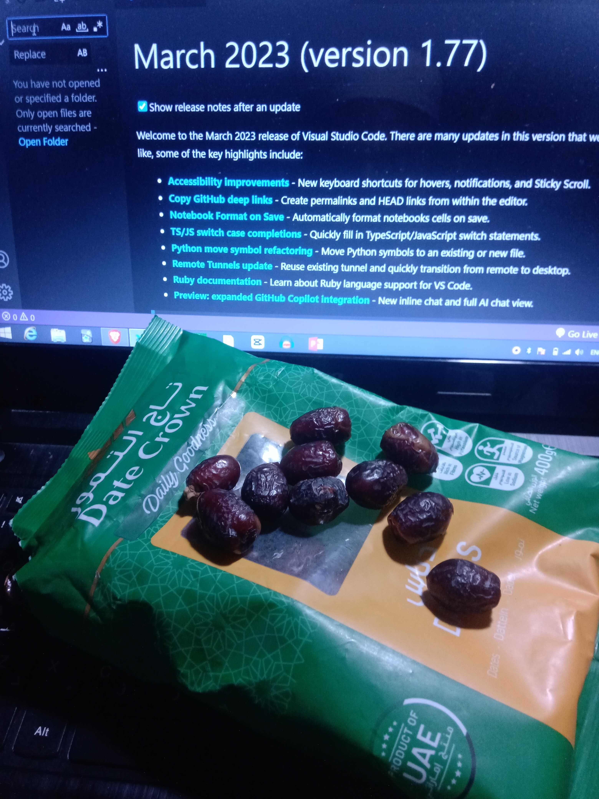

# Hello World
<!--This is a comment-->
This is a normal text  
This is a new line (need two space to create a new line)
Also html syntexes works in markdown.

<p>This is a paragraph</p>

<br/>

For Heading: use #

# H1
## H2
#### H4
###### H6

_italic_

__Bold__

~~strick through~~

`Inline code block`

### Mutliple code block
```
this is multiple line code block
```


<br/>


```html
<html>
    <head></head>
    <body></body>
</html>

```

```css
body{
    background-color: black;
}
```
### Ordered List
1. Apple
2. Ball
3. Cat
<hr/>

---

### Unordered List
- Apple
- Ball
- Cat

---

Task List  
- [] Go to home  
- [x] Sleep
- [] Wake up
- [] Let's code

### automatic link
http://www.tisabbir.com

### disable automatic link
`http://www.tisabbir.com
`
### markdown link syntax
[title](link)

[TI Sabbir](tisabbir.com)

[website](web)

<!--all link is here-->
[web]: http://tisabbir.com
[Feb]:(facebook.com/MDTISabbir)

### image syn





### Table

|Name|Email|
|----|-----|
|TI sabbir| email@gmail.com|
|TI sabbir| email@gmail.com|
|TI sabbir| email@gmail.com|
|TI sabbir| email@gmail.com|


